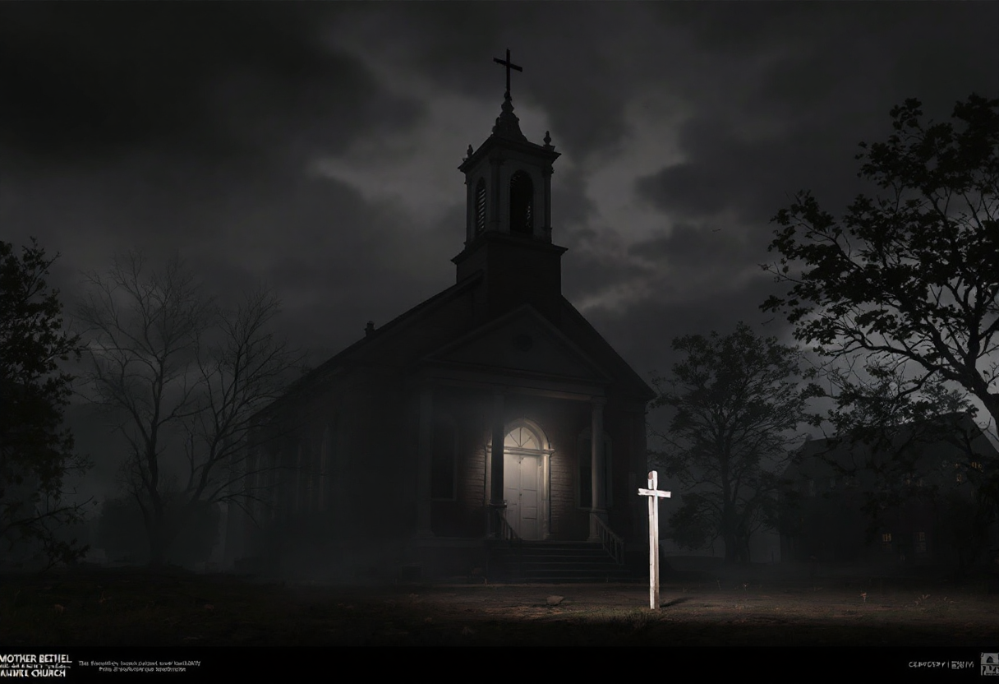

# Mother Bethel AME Church

Build a hero portal reconstruction scene with strong environmental depth.

## Production Summary

- Tour: Black American Legacy & Quaker Heritage
- Stop ID: `black-american-legacy-and-quaker-heritage-mother-bethel-ame-church`
- Priority: 1
- AR Type: `portal_reconstruction`
- Planned provider: `replicate`
- Fallback provider: `stability`
- Current generated provider: `replicate`
- Effort: `high`
- Coordinate quality: `approximate`
- Trigger radius: 40m
- Historical era: 18th to 19th century Philadelphia
- Style preset: `cinematic`
- Visual priority: `atmosphere`

## Scene Intent

exterior reconstruction scene; site card; archival textures

## Visual Direction

- Anchor style: `front_of_user`
- Fallback type: `card`
- Scale: 1
- Rotation: 180deg
- Negative prompt / avoid list: science fiction elements, neon cyberpunk styling, modern cars, modern glass towers, exaggerated fantasy ruins

## 3D / Art Deliverables

- Environment concept sheet
- Primary portal entrance composition
- 1 hero scene render
- Foreground props list
- Occlusion and anchor notes

## Runtime Assets

- iOS target asset: `/models/mother-bethel-ame-church.usdz`
- Android target asset: `/models/mother-bethel-ame-church.glb`
- Web target asset: `/models/mother-bethel-ame-church.glb`
- Current concept image path: `assets/generated/ar-references/black-american-legacy-and-quaker-heritage-mother-bethel-ame-church.png`

## Current Concept Image




## Prompt Inputs

### Replicate
```
Atmospheric concept art for a mobile augmented reality portal reconstruction experience at Mother Bethel AME Church in Philadelphia. Show exterior reconstruction scene; site card; archival textures. Historically grounded. Strong cinematic composition for an AR tour app. Historical era focus: 18th to 19th century Philadelphia. Use atmospheric lighting, layered depth, strong focal composition, and dramatic but historically respectful staging. Emphasize mood, depth, period atmosphere, and immersive scene presence. Optimize for atmospheric storytelling, cinematic scene composition, and emotionally strong historical reconstruction. Avoid: science fiction elements, neon cyberpunk styling, modern cars, modern glass towers, exaggerated fantasy ruins. Historically grounded. Strong composition for an AR tour app.
```

### Stability
```
Concept art for a mobile augmented reality portal reconstruction experience at Mother Bethel AME Church in Philadelphia. Show exterior reconstruction scene; site card; archival textures. Historically grounded. Rich visual detail. Strong composition for an AR tour app.
```

### fal
```
Concept art for a mobile augmented reality portal reconstruction experience at Mother Bethel AME Church in Philadelphia. Show exterior reconstruction scene; site card; archival textures.
```

## Notes

No additional notes.
