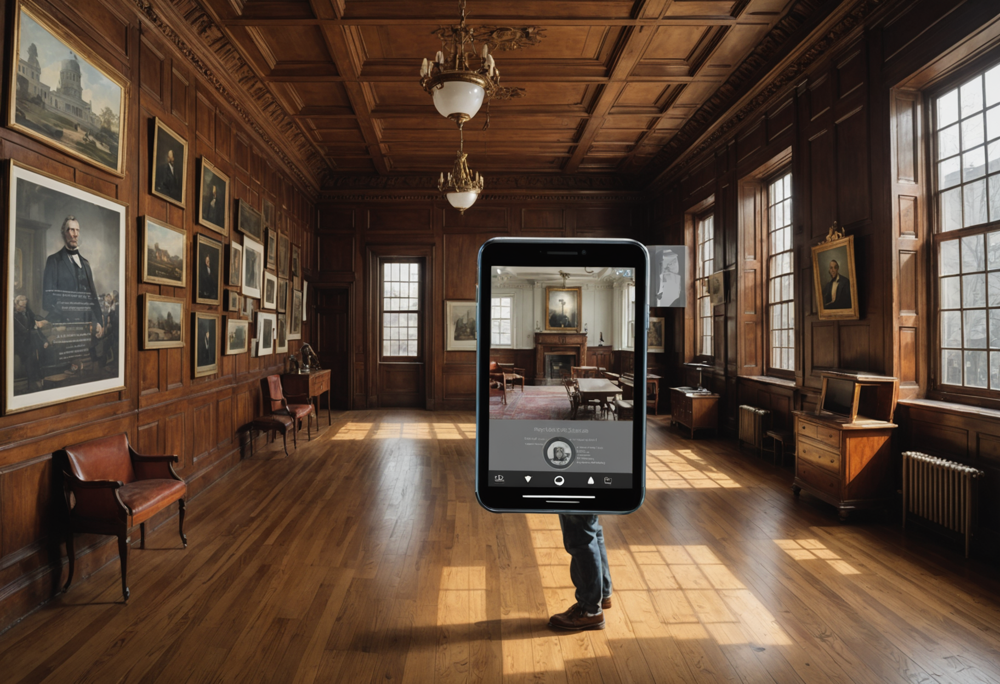

# President's House / Liberty Bell Center

Build a hero portal reconstruction scene with strong environmental depth.

## Production Summary

- Tour: Black American Legacy & Quaker Heritage
- Stop ID: `black-american-legacy-and-quaker-heritage-president-s-house-liberty-bell-center`
- Priority: 2
- AR Type: `portal_reconstruction`
- Planned provider: `replicate`
- Fallback provider: `stability`
- Current generated provider: `stability`
- Effort: `high`
- Coordinate quality: `approximate`
- Trigger radius: 40m
- Historical era: 18th to 19th century Philadelphia
- Style preset: `cinematic`
- Visual priority: `atmosphere`

## Scene Intent

household reconstruction; figure markers; timeline overlays

## Visual Direction

- Anchor style: `front_of_user`
- Fallback type: `card`
- Scale: 1
- Rotation: 180deg
- Negative prompt / avoid list: science fiction elements, neon cyberpunk styling, modern cars, modern glass towers, exaggerated fantasy ruins

## 3D / Art Deliverables

- Environment concept sheet
- Primary portal entrance composition
- 1 hero scene render
- Foreground props list
- Occlusion and anchor notes

## Runtime Assets

- iOS target asset: `/models/president-s-house-liberty-bell-center.usdz`
- Android target asset: `/models/president-s-house-liberty-bell-center.glb`
- Web target asset: `/models/president-s-house-liberty-bell-center.glb`
- Current concept image path: `assets/generated/ar-references/black-american-legacy-and-quaker-heritage-president-s-house-liberty-bell-center.png`

## Current Concept Image




## Prompt Inputs

### Replicate
```
Atmospheric concept art for a mobile augmented reality portal reconstruction experience at President's House / Liberty Bell Center in Philadelphia. Show household reconstruction; figure markers; timeline overlays. Historically grounded. Strong cinematic composition for an AR tour app.
```

### Stability
```
Concept art for a mobile augmented reality portal reconstruction experience at President's House / Liberty Bell Center in Philadelphia. Show household reconstruction; figure markers; timeline overlays. Historically grounded. Rich visual detail. Strong composition for an AR tour app. Historical era focus: 18th to 19th century Philadelphia. Use atmospheric lighting, layered depth, strong focal composition, and dramatic but historically respectful staging. Emphasize mood, depth, period atmosphere, and immersive scene presence. Optimize for high-detail environment rendering, facade structure, and crisp surface detail. Avoid: science fiction elements, neon cyberpunk styling, modern cars, modern glass towers, exaggerated fantasy ruins. Historically grounded. Strong composition for an AR tour app.
```

### fal
```
Concept art for a mobile augmented reality portal reconstruction experience at President's House / Liberty Bell Center in Philadelphia. Show household reconstruction; figure markers; timeline overlays.
```

## Notes

No additional notes.
