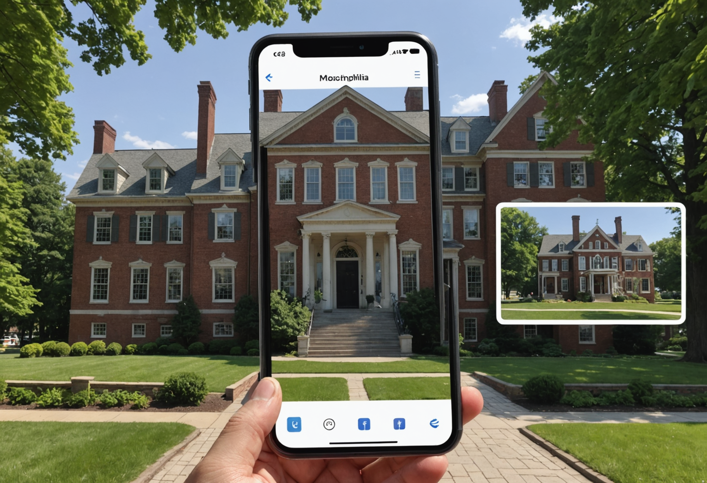

# The Woodlands

Build a facade-accurate overlay optimized for before/after comparison.

## Production Summary

- Tour: Black American Legacy & Quaker Heritage
- Stop ID: `black-american-legacy-and-quaker-heritage-the-woodlands`
- Priority: 4
- AR Type: `before_after_overlay`
- Planned provider: `stability`
- Fallback provider: `fal`
- Current generated provider: `stability`
- Effort: `medium`
- Coordinate quality: `verified`
- Trigger radius: 40m
- Historical era: historic Philadelphia
- Style preset: `architectural`
- Visual priority: `facade_accuracy`

## Scene Intent

mansion overlay; cemetery context cards

## Visual Direction

- Anchor style: `front_of_user`
- Fallback type: `card`
- Scale: 1
- Rotation: 180deg
- Negative prompt / avoid list: warped facades, floating architecture, futuristic materials, incorrect street geometry, fantasy skyline

## 3D / Art Deliverables

- Facade match sheet
- Alignment reference overlay
- Street-view proportion notes
- Material palette
- Historic signage/details list

## Runtime Assets

- iOS target asset: `/models/the-woodlands.usdz`
- Android target asset: `/models/the-woodlands.glb`
- Web target asset: `/models/the-woodlands.glb`
- Current concept image path: `assets/generated/ar-references/black-american-legacy-and-quaker-heritage-the-woodlands.png`

## Current Concept Image




## Prompt Inputs

### Replicate
```
n/a
```

### Stability
```
Concept art for a mobile augmented reality before after overlay experience at The Woodlands in Philadelphia. Show mansion overlay; cemetery context cards. Historically grounded. Rich visual detail. Strong composition for an AR tour app. Historical era focus: historic Philadelphia. Prioritize architectural fidelity, straight lines, facade detail, masonry, windows, signage, and historically believable materials. Emphasize exact building frontage, proportions, street-facing detail, and before/after alignment potential. Optimize for high-detail environment rendering, facade structure, and crisp surface detail. Avoid: warped facades, floating architecture, futuristic materials, incorrect street geometry, fantasy skyline. Historically grounded. Strong composition for an AR tour app.
```

### fal
```
Concept art for a mobile augmented reality before after overlay experience at The Woodlands in Philadelphia. Show mansion overlay; cemetery context cards.
```

## Notes

No additional notes.
