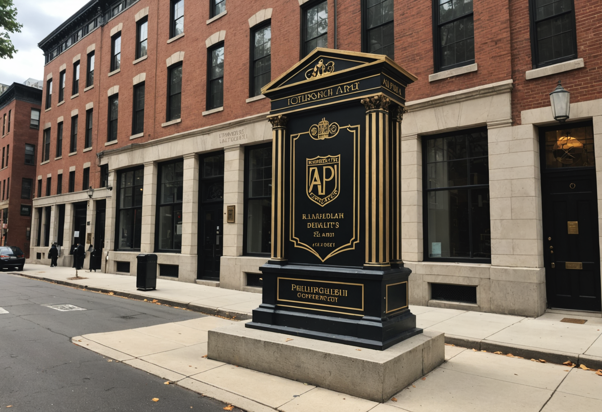

# Alpha Phi Alpha - 42nd & Chestnut

Build a museum-style hero object scene with clean educational framing.

## Production Summary

- Tour: Divine 9 Legacy Tour
- Stop ID: `divine-9-legacy-tour-alpha-phi-alpha-42nd-and-chestnut`
- Priority: 8
- AR Type: `object_on_plinth`
- Planned provider: `stability`
- Fallback provider: `fal`
- Current generated provider: `stability`
- Effort: `medium`
- Coordinate quality: `verified`
- Trigger radius: 40m
- Historical era: historic Philadelphia
- Style preset: `architectural`
- Visual priority: `historical_accuracy`

## Scene Intent

crest; chapter marker; founding timeline objects

## Visual Direction

- Anchor style: `front_of_user`
- Fallback type: `card`
- Scale: 1
- Rotation: 180deg
- Negative prompt / avoid list: floating fragments, broken anatomy, abstract sculptures, futuristic materials

## 3D / Art Deliverables

- Hero object turnaround
- Base/plinth design
- Material callouts
- Supporting annotation card
- Scale reference

## Runtime Assets

- iOS target asset: `/models/alpha-phi-alpha-42nd-and-chestnut.usdz`
- Android target asset: `/models/alpha-phi-alpha-42nd-and-chestnut.glb`
- Web target asset: `/models/alpha-phi-alpha-42nd-and-chestnut.glb`
- Current concept image path: `assets/generated/ar-references/divine-9-legacy-tour-alpha-phi-alpha-42nd-and-chestnut.png`

## Current Concept Image




## Prompt Inputs

### Replicate
```
n/a
```

### Stability
```
Concept art for a mobile augmented reality object on plinth experience at Alpha Phi Alpha - 42nd & Chestnut in Philadelphia. Show crest; chapter marker; founding timeline objects. Historically grounded. Rich visual detail. Strong composition for an AR tour app. Historical era focus: historic Philadelphia. Prioritize architectural fidelity, straight lines, facade detail, masonry, windows, signage, and historically believable materials. Emphasize historically grounded objects, clothing, signage, and environment details over fantasy styling. Optimize for high-detail environment rendering, facade structure, and crisp surface detail. Avoid: floating fragments, broken anatomy, abstract sculptures, futuristic materials. Historically grounded. Strong composition for an AR tour app.
```

### fal
```
Concept art for a mobile augmented reality object on plinth experience at Alpha Phi Alpha - 42nd & Chestnut in Philadelphia. Show crest; chapter marker; founding timeline objects.
```

## Notes

No additional notes.
