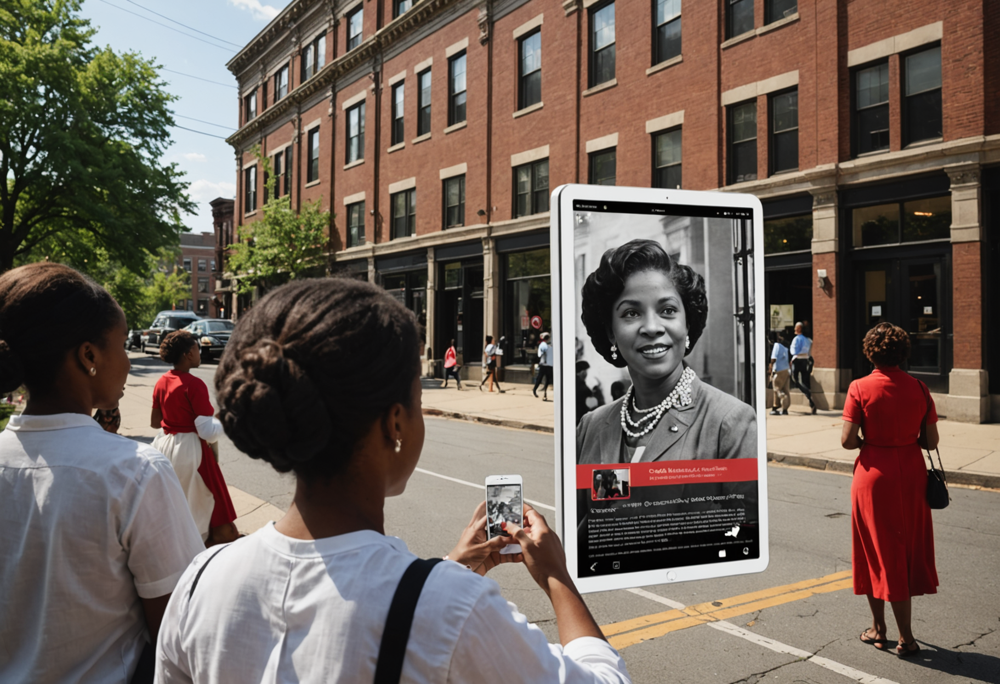

# Delta Sigma Theta - 40th & Market

Build a lightweight editorial AR card experience optimized for readability.

## Production Summary

- Tour: Divine 9 Legacy Tour
- Stop ID: `divine-9-legacy-tour-delta-sigma-theta-40th-and-market`
- Priority: 9
- AR Type: `floating_story_card`
- Planned provider: `fal`
- Fallback provider: `stability`
- Current generated provider: `stability`
- Effort: `low`
- Coordinate quality: `verified`
- Trigger radius: 40m
- Historical era: historic Philadelphia
- Style preset: `editorial`
- Visual priority: `readability`

## Scene Intent

public act timeline; archival photos; chapter card

## Visual Direction

- Anchor style: `front_of_user`
- Fallback type: `card`
- Scale: 1
- Rotation: 180deg
- Negative prompt / avoid list: busy backgrounds, unreadable layouts, overdecorated borders, dense clutter

## 3D / Art Deliverables

- Primary concept render
- Supporting annotation card
- Environment/material notes

## Runtime Assets

- iOS target asset: `/models/delta-sigma-theta-40th-and-market.usdz`
- Android target asset: `/models/delta-sigma-theta-40th-and-market.glb`
- Web target asset: `/models/delta-sigma-theta-40th-and-market.glb`
- Current concept image path: `assets/generated/ar-references/divine-9-legacy-tour-delta-sigma-theta-40th-and-market.png`

## Current Concept Image




## Prompt Inputs

### Replicate
```
n/a
```

### Stability
```
Concept art for a mobile augmented reality floating story card experience at Delta Sigma Theta - 40th & Market in Philadelphia. Show public act timeline; archival photos; chapter card. Historically grounded. Rich visual detail. Strong composition for an AR tour app. Historical era focus: historic Philadelphia. Use clean editorial composition, readable foreground subject placement, and uncluttered negative space suitable for mobile AR cards. Emphasize clarity, readable composition, simple silhouettes, and reduced background clutter. Optimize for high-detail environment rendering, facade structure, and crisp surface detail. Avoid: busy backgrounds, unreadable layouts, overdecorated borders, dense clutter. Historically grounded. Strong composition for an AR tour app.
```

### fal
```
Concept art for a mobile augmented reality floating story card experience at Delta Sigma Theta - 40th & Market in Philadelphia. Show public act timeline; archival photos; chapter card.
```

## Notes

No additional notes.
