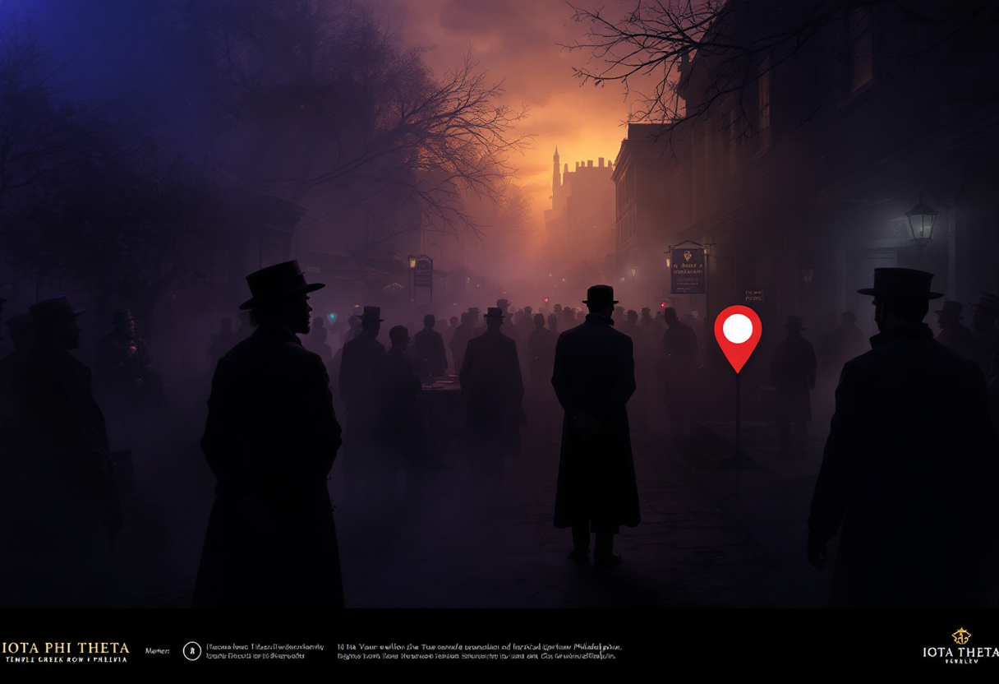

# Iota Phi Theta - Temple Greek Row

Build a respectful figure-led scene with strong silhouette and historical context.

## Production Summary

- Tour: Divine 9 Legacy Tour
- Stop ID: `divine-9-legacy-tour-iota-phi-theta-temple-greek-row`
- Priority: 10
- AR Type: `historical_figure_presence`
- Planned provider: `replicate`
- Fallback provider: `stability`
- Current generated provider: `replicate`
- Effort: `medium`
- Coordinate quality: `verified`
- Trigger radius: 40m
- Historical era: late 19th to 20th century Philadelphia
- Style preset: `cinematic`
- Visual priority: `silhouette`

## Scene Intent

legacy scene; organization timeline; marker overlay

## Visual Direction

- Anchor style: `front_of_user`
- Fallback type: `card`
- Scale: 1
- Rotation: 180deg
- Negative prompt / avoid list: uncanny faces, caricature proportions, modern clothing, modern accessories, crowd clutter

## 3D / Art Deliverables

- Figure silhouette concept
- Pose and staging sheet
- Supporting environment pass
- Wardrobe/reference notes
- Respect and likeness guardrails

## Runtime Assets

- iOS target asset: `/models/iota-phi-theta-temple-greek-row.usdz`
- Android target asset: `/models/iota-phi-theta-temple-greek-row.glb`
- Web target asset: `/models/iota-phi-theta-temple-greek-row.glb`
- Current concept image path: `assets/generated/ar-references/divine-9-legacy-tour-iota-phi-theta-temple-greek-row.png`

## Current Concept Image




## Prompt Inputs

### Replicate
```
Atmospheric concept art for a mobile augmented reality historical figure presence experience at Iota Phi Theta - Temple Greek Row in Philadelphia. Show legacy scene; organization timeline; marker overlay. Historically grounded. Strong cinematic composition for an AR tour app. Historical era focus: late 19th to 20th century Philadelphia. Use atmospheric lighting, layered depth, strong focal composition, and dramatic but historically respectful staging. Emphasize strong human silhouette, respectful figure staging, and recognizable pose over facial close-up detail. Optimize for atmospheric storytelling, cinematic scene composition, and emotionally strong historical reconstruction. Avoid: uncanny faces, caricature proportions, modern clothing, modern accessories, crowd clutter. Historically grounded. Strong composition for an AR tour app.
```

### Stability
```
Concept art for a mobile augmented reality historical figure presence experience at Iota Phi Theta - Temple Greek Row in Philadelphia. Show legacy scene; organization timeline; marker overlay. Historically grounded. Rich visual detail. Strong composition for an AR tour app.
```

### fal
```
Concept art for a mobile augmented reality historical figure presence experience at Iota Phi Theta - Temple Greek Row in Philadelphia. Show legacy scene; organization timeline; marker overlay.
```

## Notes

No additional notes.
