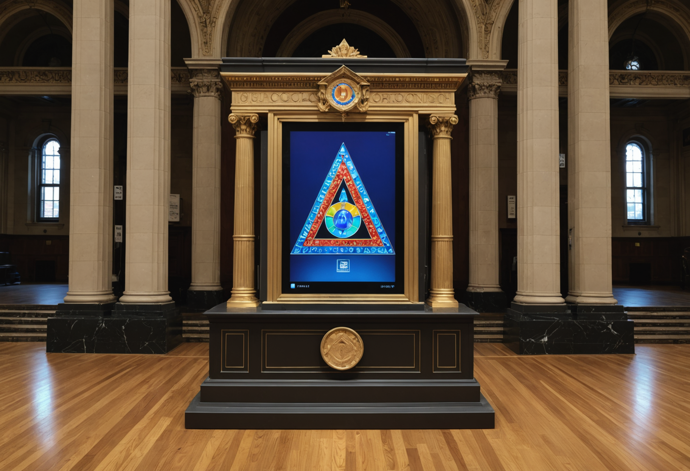

# Masonic Temple

Build a museum-style hero object scene with clean educational framing.

## Production Summary

- Tour: Rainbow Girls Philadelphia
- Stop ID: `rainbow-girls-philadelphia-masonic-temple`
- Priority: 5
- AR Type: `object_on_plinth`
- Planned provider: `stability`
- Fallback provider: `fal`
- Current generated provider: `stability`
- Effort: `medium`
- Coordinate quality: `approximate`
- Trigger radius: 40m
- Historical era: late 19th to 20th century Philadelphia
- Style preset: `architectural`
- Visual priority: `historical_accuracy`

## Scene Intent

Rainbow jewels; ceremonial symbols; spatial story cards

## Visual Direction

- Anchor style: `front_of_user`
- Fallback type: `card`
- Scale: 1
- Rotation: 180deg
- Negative prompt / avoid list: floating fragments, broken anatomy, abstract sculptures, futuristic materials

## 3D / Art Deliverables

- Hero object turnaround
- Base/plinth design
- Material callouts
- Supporting annotation card
- Scale reference

## Runtime Assets

- iOS target asset: `/models/masonic-temple.usdz`
- Android target asset: `/models/masonic-temple.glb`
- Web target asset: `/models/masonic-temple.glb`
- Current concept image path: `assets/generated/ar-references/rainbow-girls-philadelphia-masonic-temple.png`

## Current Concept Image




## Prompt Inputs

### Replicate
```
n/a
```

### Stability
```
Concept art for a mobile augmented reality object on plinth experience at Masonic Temple in Philadelphia. Show Rainbow jewels; ceremonial symbols; spatial story cards. Historically grounded. Rich visual detail. Strong composition for an AR tour app. Historical era focus: late 19th to 20th century Philadelphia. Prioritize architectural fidelity, straight lines, facade detail, masonry, windows, signage, and historically believable materials. Emphasize historically grounded objects, clothing, signage, and environment details over fantasy styling. Optimize for high-detail environment rendering, facade structure, and crisp surface detail. Avoid: floating fragments, broken anatomy, abstract sculptures, futuristic materials. Historically grounded. Strong composition for an AR tour app.
```

### fal
```
Concept art for a mobile augmented reality object on plinth experience at Masonic Temple in Philadelphia. Show Rainbow jewels; ceremonial symbols; spatial story cards.
```

## Notes

No additional notes.
